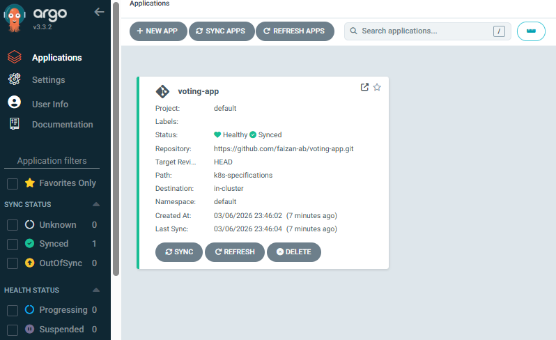
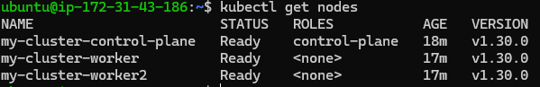
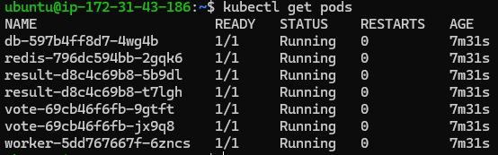
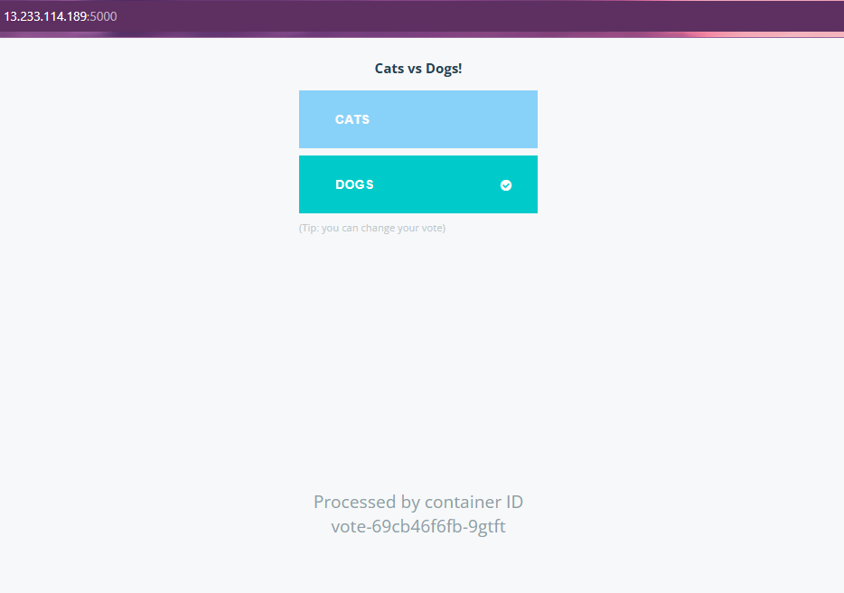
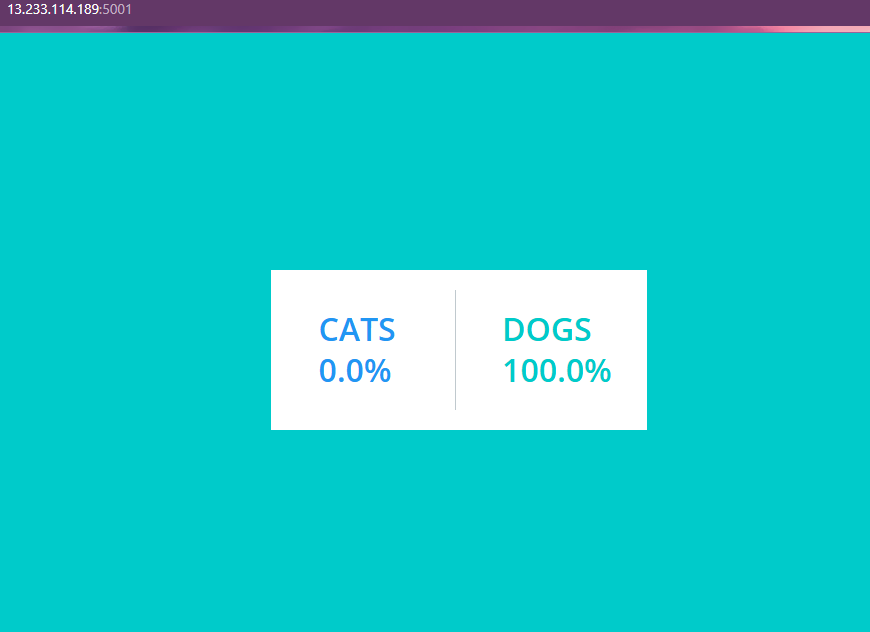
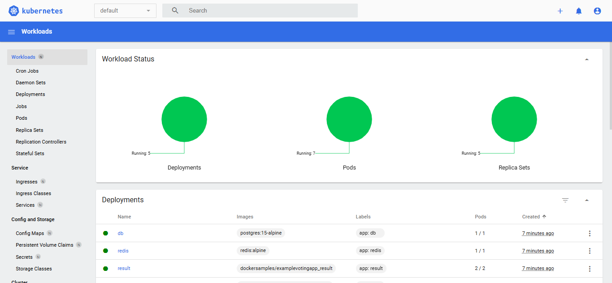

# 🚀 Kubernetes GitOps Deployment using ArgoCD on AWS EC2

This project demonstrates **GitOps-based application deployment using ArgoCD on a Kubernetes cluster running on AWS EC2**.

The Kubernetes cluster is created using **Kind**, and ArgoCD automatically synchronizes application manifests from GitHub and deploys them into the cluster.

The deployed application is a **microservices-based voting application** consisting of:

* Vote Service
* Result Service
* Worker Service
* Redis
* PostgreSQL

---

## 🏗 Architecture


```
                 GitHub Repository
                         │
                         │ (GitOps)
                         ▼
                     ArgoCD
               Continuous Delivery
                         │
                         ▼
                Kubernetes Cluster
            (Kind running on AWS EC2)
                         │
        ┌───────────────┼───────────────┐
        │               │               │
     Vote App        Result App       Worker
        │
        ▼
   Redis + PostgreSQL
        │
        ▼
 Kubernetes Dashboard

---

 ```

## ⚙️ Project Workflow

```
Developer pushes code → GitHub Repository
        ↓
ArgoCD detects changes
        ↓
ArgoCD syncs manifests
        ↓
Kubernetes deploys services
        ↓
Application becomes available

```

---

## ⚙️ Tech Stack

* AWS EC2
* Docker
* Kubernetes (Kind)
* kubectl
* ArgoCD
* Redis
* PostgreSQL
* Kubernetes Dashboard

---

## ☁️ Infrastructure Setup

EC2 Configuration

| Parameter     | Value        |
| ------------- | ------------ |
| Instance Type | t2.medium    |
| OS            | Ubuntu 24.04 |
| Storage       | 30GB         |

Kubernetes Cluster

* 1 Control Plane
* 2 Worker Nodes

---

## 🔧 Setup Steps

### Install Docker

```
sudo apt update
sudo apt install docker-ce docker-ce-cli containerd.io -y
```

### Install Kind

```
curl -Lo ./kind https://kind.sigs.k8s.io/dl/v0.20.0/kind-linux-amd64
chmod +x kind
sudo mv kind /usr/local/bin/
```

### Create Kubernetes Cluster

```
kind create cluster --config=config.yml --name my-cluster
```

### Install kubectl

```
curl -LO https://dl.k8s.io/release/v1.30.0/bin/linux/amd64/kubectl
chmod +x kubectl
sudo mv kubectl /usr/local/bin/
```

---

## 🚀 Install ArgoCD

```
kubectl create namespace argocd
kubectl apply -n argocd -f https://raw.githubusercontent.com/argoproj/argo-cd/stable/manifests/install.yaml
```

Access ArgoCD

```
https://EC2_PUBLIC_IP:8443
```

---

## 📦 Deploy Application

Create an **ArgoCD Application** pointing to the Voting App repository.

ArgoCD will automatically:

* Pull Kubernetes manifests
* Deploy services
* Keep the cluster synced with GitHub

---

## 🌐 Access the Application

Vote Application

```
http://EC2_PUBLIC_IP:5000
```

Result Application

```
http://EC2_PUBLIC_IP:5001
```

---

## 📊 Kubernetes Dashboard

Deploy dashboard

```
kubectl apply -f https://raw.githubusercontent.com/kubernetes/dashboard/v2.7.0/aio/deploy/recommended.yaml
```

Access dashboard

```
https://EC2_PUBLIC_IP:8080
```

---

## 📸 Screenshots

### ArgoCD Dashboard



### Kubernetes Nodes



### Kubernetes Pods



### Vote Application



### Result Application



### Kubernetes Dashboard



---

## 📚 Key Learnings

* GitOps deployment using ArgoCD
* Managing Kubernetes clusters with Kind
* Deploying microservices applications
* Kubernetes service networking
* Troubleshooting container runtime issues

---

👨‍💻 Author

Mohammed Abdul Faizan

DevOps & Cloud Enthusiast

